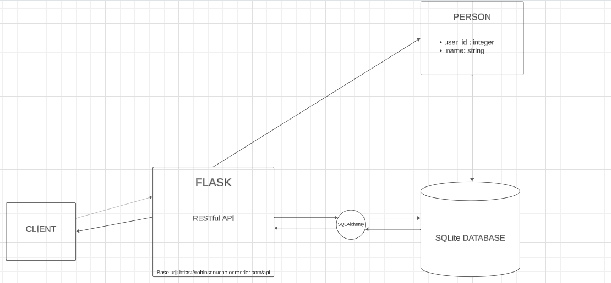

# **Stage 2 - A simple CRUD Api written in PYTHON.**

## **Description**

This API is written in the Python programming language, and uses SQLALchemy as the object relational mapper (ORM), Marshmallow as the serializer and deserializer, and SQLite as database.

It allows a user to create a person, find a person, update a person and also delete a person's data from the database.
The project's entry point is app.py.

## **API Documentation**

The API is fully documented, and can be found [here](https://documenter.getpostman.com/view/29597896/2s9YC4VtXE).

## UML Diagram



## Testing

Unit tests/feature tests were not part of the requirements, but from the API docs in the link above, you will be able to test it on Postman.

## **Known Limitations and Assumptions**

This API assumes that person records are uniquely identified by their user_id.
The API uses a SQLite database for simplicity. In a production environment, a more robust database solution should be considered.
Error responses are standardized but can be further customized to meet specific requirements.

## **Local Setup:**

* Ensure you have Python installed
* Install your virtual environment
  ```python3 -m venv venv```
* Activate your virtual environment
  ```source ~/venv/bin/activate```
* Clone this repository.
  ```git clone https://github.com/Rob-in-son/HNG.git```
* Get into the repository directory
  ```cd stage2```
* Install the required dependencies listed in requirements.txt.
  ```pip install -r requirements.txt```
* Run the application using
  ``` python app.py ```
* The API will be accessible locally at <http://127.0.0.1:5000/>
